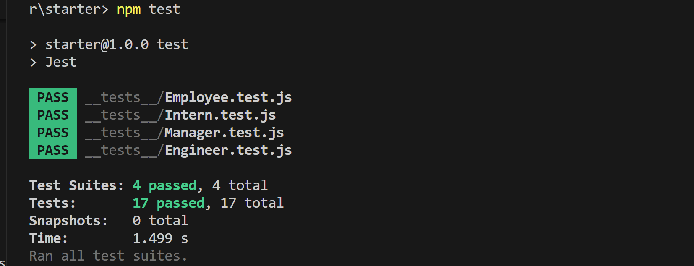
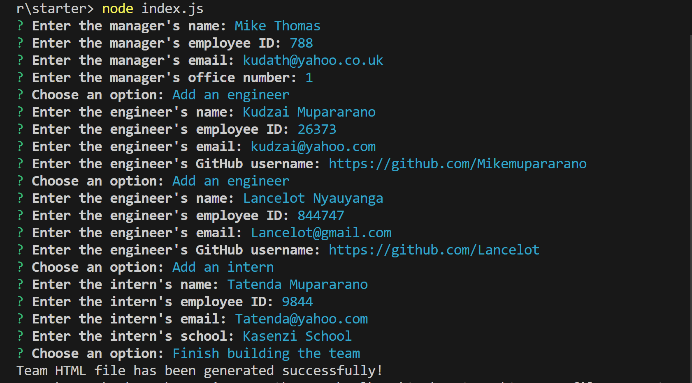
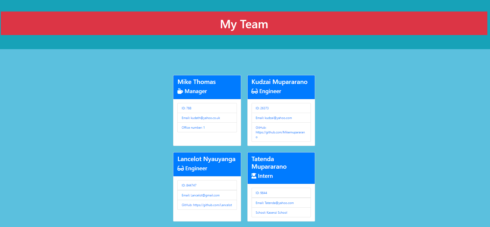

# Team Profile Generator 
## Description
As I enter the final phases of my web development course, I have created an app that serves a great purpose at work places. Many companies have development teams that accomplish different roles. This application will take in information about employees on a software engineering team, then generate an HTML webpage that displays summaries for each person. 

 To gather information about the development team members and render the HTML file, I have used the Inquirer package to prompt the user for input regarding each team member. After gathering the information, the app creates objects for each team member using the 'Employee' class as blueprint. The Engineer, Intern and Manager classes extend the Employee class. Lastly, I can call the render function and pass in an array containing all employee objects to generate an HTML file. How great is that!

 Also, the application passes all the test: Employee, Manager, Engineer and Intern, which is great (see below for images of the tests).

## Table of Contents
- [Team Profile Generator](#team-profile-generator)
  - [Description](#description)
  - [Table of Contents](#table-of-contents)
  - [Installation](#installation)
  - [Usage](#usage)
  - [License](#license)
  - [Contributing](#contributing)
  - [Credits](#credits)
  - [Tests](#tests)
  - [Questions](#questions)

## Installation
The user is advised to have downloaded and installed node.js from here: https://nodejs.org/en/download/
•	$ npm install
•	$ npm init-y
•	Npm install node.js

## Usage
When a user starts the application in the command line terminal (e.g node index.js), they're prompted to enter the team manager's: (1) Name, (2)Employee ID, (3) Email address,  and (4) Office number.

When a user enters the above requirements, the user is presented with a menu with the option to:
-Add an engineer
-Add an intern
-Finish building the team

When a user selects the engineer option, the user is prompted to enter the following and then taken back to the menu: (1) Engineer's Name, (2) ID, (3) Email, and (4) GitHub username

When a user selects the intern option, the user is prompted to enter the following and then taken back to the menu: (1) Intern’s name, (2) ID, (3) Email,  and (4) School

When a user decides to finish building their team, they exit the application and the HTML is generated in the "output" folder. The render function passes in an array containing all employee objects. The render function will generate and return a block of HTML including template div elements for each employee.

The file named team.html in the output folder will be the result. Open this file in live server or Google Chrome, for example to view the styled team profile app.

Also, when a user clicks on the links in the Table of Contents, they are taken to the corresponding section of the README.
The inquirer package handles the questions and the user’s input answers.
•	To invoke the application, the user should use the following code:
node index.js
•	The application can be found on this repository link:
A screenshot of the app is shown here:https://github.com/Mikemupararano/team-profile-generator
Screenshot of the test:

An image of the user input is shown here:

The generated team profile will show in the 'output' folder. Here is the screenshot of the team profile: 

The genrated html is located here: https://github.com/Mikemupararano/team-profile-generator/blob/main/starter/output/team.html.

## License
This application is covered under the MIT license.

## Contributing
I have created a branch called 'employee' that I would like users to cone and contribute towards the improvement of this web application. The branch is found on this link: https://github.com/Mikemupararano/team-profile-generator/tree/employee.

## Credits
I researched website and watched several videos to adapt and work out the code in this web application. I used the following web-links for research and support:
Mike Thomas
(2) https://javascript.plainenglish.io/how-to-inquirer-js-c10a4e05ef1f
(3)https://www.digitalocean.com/community/tutorials/nodejs-interactive-command-line-prompts
(4) https://www.browserstack.com/guide/bootstrap-mobile-responsive
(5) https://www.youtube.com/watch?v=soKo5LzN12w
(6) https://www.youtube.com/watch?v=31LhQkLcZvE

## Tests
N/A

## Questions
For any questions or concerns, please contact me at [kudath@yahoo.co.uk](mailto:kudath@yahoo.co.uk).
You can also find me on GitHub: [https://github.com/Mikemupararano](https://github.com/https://github.com/Mikemupararano)
